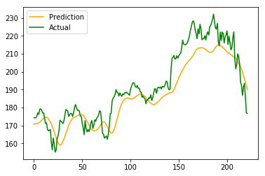

## Time Series Forecasting for Stock Data using LSTMs

### Introduction

Predicting time series data is a common problem in many domains, one of which is the stock market. In order to send profitable buy/sell signals, it is necessary to accurately predict the movement of the market. Currently, most approaches are based on technical indicators, which suffer from time lag. We attempt to build a model that accomplishses this task and test whether or not it is able to earn a profit. If the experiment is successful, this provides a way to reliably earn money from the stock market in an automated way.

### Approach

Our dataset consists of stock data from Yahoo Finance. They provide the Open, High, Low, Close, Volume, and Adjusted Close values for the symbols AAPL, AMZN, FB, GOOG, and SPY from January 1st, 2010 to present day (November 23rd, 2018 at the time of running). The training data consists of the Open, High, Low, Volume, and Adjusted Close values for AAPL, normalized with a 90/10 training/testing split.

We fed this data into a Long Short-Term Memory network (LSTMs), which are the go-to model for sequence analysis. Specifically, we used two stacked LSTMs (the output of the first LSTM is the input for the second) 256 units each, with 30% dropout and a final fully-connected layer with mean-squared error as the loss function. In order to test our model, we write a simple agent that buys/sells based on the predicted momentum of the market (a technical indicator).

(Obligatory image from colah's blog)

### Results

This is a comparison of the actual and predicted values for the AAPL stock.

The model seems to capture the general movement of the market well. However, it is evident that it still lags behind in prediction much like other prediction methods based on technical indicators. Additionally, the extremes are not as prominent, most likely due to the fact that the network is remembering previous, lower prices.

We gave our agent $10,000,000 and it was able to earn a 16.2% profit over one market year. While not as profitable as the leading hedge funds (30-40% per year), the model still acheives a decent profit of $1,624,499.81. Of course, this is scaled based on the starting amount. It is possible a more intelligent agent could reap more rewards from the prediction model.
